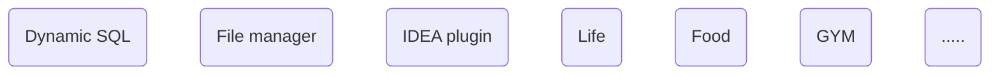

Bookmark this to keep an eye on my life updates!

- 👀 I’m interested in ...
- 🌱 I’m currently learning how to live every day you know...
- 🎉 Any way, I have something to show you!

## ☕️ Some keywords!



### about sql

This is **dynamic sql** paring as you think, if `id` is `11` ,you should be know the result! 

```sql
select * from test.user where
-- #if :id >= 100
  id = 99
-- #else
  id = :id
-- #fi
```

You can get more information from [rabbit-sql](https://github.com/chengyuxing/rabbit-sql?tab=readme-ov-file#Dynamic-SQL) to set up your project, following a simple project, e.g


Oh don't forget the **IDEA-IU** [rabbit-sql-plugin](https://plugins.jetbrains.com/plugin/21403-rabbit-sql), it will provides more help for you working with your project, **test dynamic sql**, e.g


